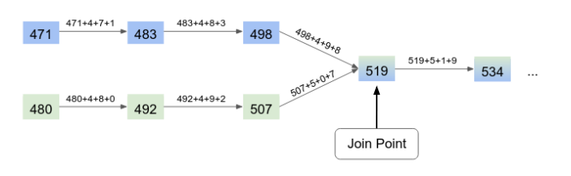

Please find below the list technical test for your recruitment at LyBox.

The different exercice are written for Golang function but you can use any language among Golang, Javascript, PHP, Python.

You should limit yourself to one hours and not more even if you didn't have time to finish everyting.

### Range Sum
##### (5 minute)

Write the body of the `func Calc(arr []int, n1, n2 int) int` function.

`arr` is a slice of integers. The `n1` and `n2` parameters are integers defined by the relation `0 <= n1
<= n2 < len(arr)` .

The Calc function should return the sum of the integers of arr whose index belongs to the [n1; n2]
interval.

### Regex
##### (15 minute)

We need to analyse a list of offers to extract the rent price of apartment.

Write the body of the `func ExtractRent(content string) float` function.

`content` is the offer content. The function should return the yearly rent includes in the content.

You can test with the following content :
- `Loyer en cours de 430 € /mois hors charges` -> Should return 5160
- `cet appartement au premier étage est actuellement loué 400 euros par mois` -> Should return 4800
- `Investissement locatif T2 loué 496€/mois dont 26€ de charges.` -> Should return 5952
- `type 1 rénové de 34 m2 vendu loué en bail meublé avec un loyer de 500EUR hors charges et 20EUR de provisions sur charges` -> Should return 6000
- `Percevez 5548 € (sans les charges) de loyer garanti/an` -> Should return 5548
- `le loyer actuel est de 5000,00 euros/an.` -> Should return 5000

### Joining point
##### (40 minute)

We consider the sequence of numbers where a number is followed by the same number plus the sum of
its digits.

For example `34` is followed by `41` (as 41 = 34 + (3 + 4)). `41` is itself followed by `46` (46 = 41 + (4 + 1)).

Two sequences which start from different numbers may join at a given point, for example, the sequence
starting from `471` and the sequence starting from `480` share the number `519` (the join point) in their
sequence. After the join point, the sequences are equal.

An example of two sequences joining at `519`.

Implement the function `ComputeJoinPoint(s1 int, s2 int) int` which takes the starting points
of two sequences and then returns the join point of these sequences.

ComputeJoinPoint(480, 471) should return 519

ComputeJoinPoint(471, 492) should return 519

ComputeJoinPoint(480, 483) should return 519

Constraints:
The given sequences always join 0 < `s1, s2` < 20000000 0 < join point < 20000000
